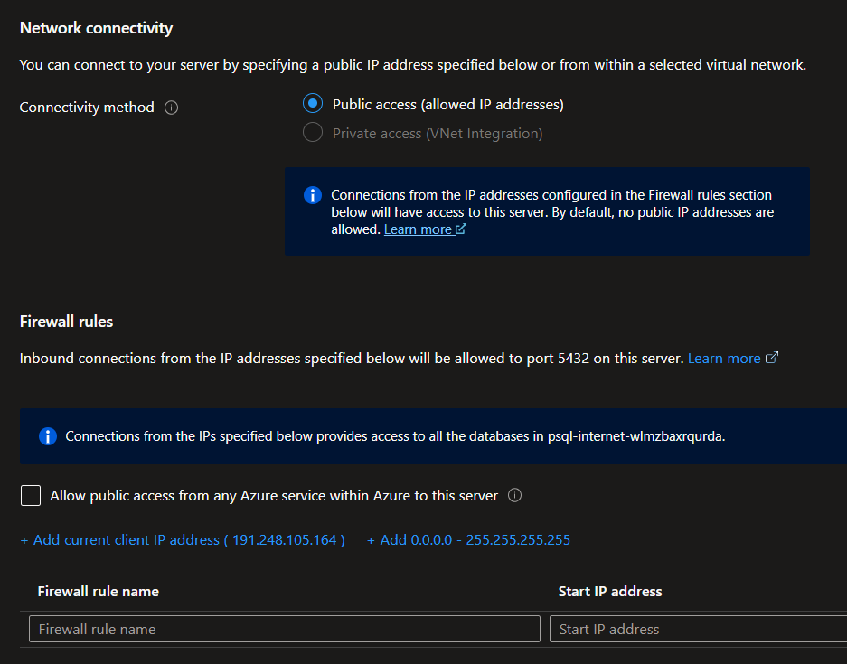
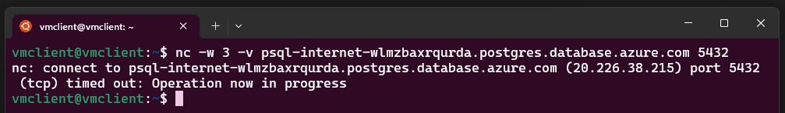
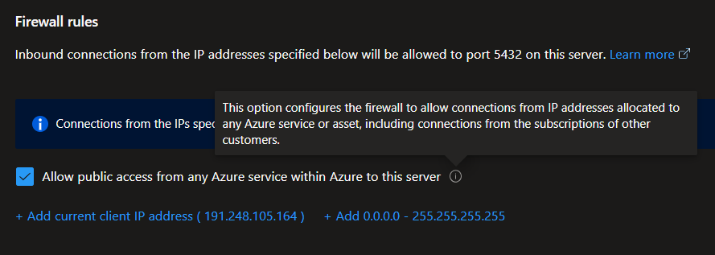
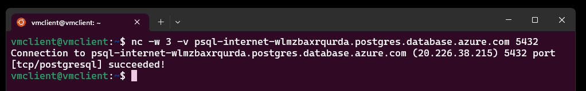
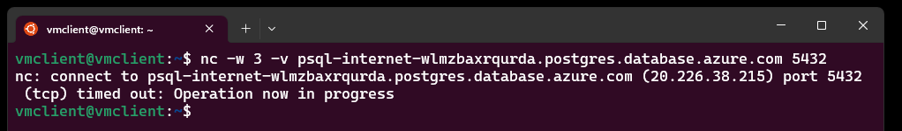
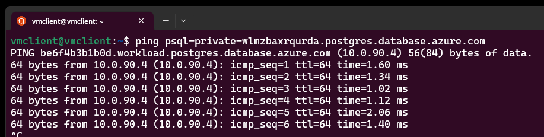
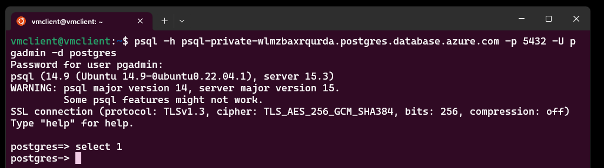

# Azure PostgreSQL VNET integration

Demonstrating VNET integration with PostgreSQL Flexible Server.

As of today, Flexible Server currently does not support Private Endpoints.

```sh
az group create -n rg-myapp -l brazilsouth
```

Copy the template and set your variables:

```sh
cp config-template.json config.json
```

Always check for Bicep upgrades: `az bicep upgrade`.

Generate the keys to connect to the VM:

```sh
ssh-keygen -f ./id_rsa
```

Create the resources:

```sh
az deployment group create -g rg-myapp -f main.bicep
```

To connect to the VM:

```sh
ssh -i id_rsa vmclient@<public-ip>
```

## Public Access

This section will test different settings for the Public access.

As a baseline configuration for this workload, no origin is allowed:



As expected, all access is blocked, including from the VNET:

> 💡 Notice that the resolved IP is public, as expected



Checking the box to allow Azure services will open the connectivity from the VNET resources.

⚠️ **However**, it does come with a disclaimer, on which it also includes undesired origins:

> This option configures the firewall to allow connections from IP addresses allocated to any Azure service or asset, including connections from the subscriptions of other customers.



We can confirm that, even not as secure as expected, it does allow connectivity from the VNET:



As a last test with Public access, adding the VNET CIDR will have no effect, as this PostgreSQL instance is not integrated into a VNET.


This will not work:




## Private Access (VNET)

With the private PostgreSQL instance, we have extra security.

The first noticeable change is that the DNS will respond to a private IP, thanks to the Private DNS Zone integration link:



From the VM subnet, it is possible to connect privately.

```sh
psql -h psql-private-wlmzbaxrqurda.postgres.database.azure.com -p 5432 -U pgadmin -d postgres
```

Results, as expected:



## Documentation

- To find the latest API versions access [Azure REST API Specs][1].
- Detailed API values can be found at the [REST API][2] documentation.
- More bout dedicated services in the [documentation][3].
- Also more information about PostgreSQL Flexible Server [networking concepts][4].

[1]: https://github.com/Azure/azure-rest-api-specs
[2]: https://learn.microsoft.com/en-us/azure/templates/microsoft.dbforpostgresql/flexibleservers?pivots=deployment-language-bicep
[3]: https://learn.microsoft.com/en-us/azure/virtual-network/virtual-network-for-azure-services
[4]: https://learn.microsoft.com/en-us/azure/postgresql/flexible-server/concepts-networking
